# Transcriptome-based prediction of anti-TNFα treatment outcomes in inflammatory bowel diseases
This repository contains code and data from the study identifying potential transcriptomic biomarkers of response to anti-TNFα therapy in inflammatory bowel disease (IBD). The research was conducted at the Bioinformatics Institute (2024-2025).

# Goal
Identify transcriptomic markers associated with treatment response by comparing gene expression profiles in responders and non-responders before anti-TNF-α therapy

# Introduction
Inflammatory bowel diseases (IBD), including ulcerative colitis (UC) and Crohn’s disease (CD), are chronic inflammatory disorders characterized by significant interindividual variability in disease progression and therapeutic response. Among the main treatment strategies are tumor necrosis factor-α (TNF-α) inhibitors, such as infliximab. Despite their widespread use, a substantial proportion of patients (up to 40%) fail to respond to anti-TNF therapy, highlighting the need to identify molecular predictors of treatment resistance and to better understand the underlying mechanisms.
In this study, we performed an integrated transcriptomic analysis (bulk and single-cell RNA-seq) to identify key components of the innate immune response associated with non-responsiveness to anti-TNF therapy.

# Data

**UC cohorts:**
- [**GSE12251**](https://www.ncbi.nlm.nih.gov/geo/query/acc.cgi?acc=GSE12251) – UC train; 23 patients (12 non-responders, 11 responders)
- [**GSE23597**](https://www.ncbi.nlm.nih.gov/geo/query/acc.cgi?acc=GSE23597) – UC validation; 32 patients (25 non-responders, 7 responders)

**CD cohorts:**
- [**GSE16879**](https://www.ncbi.nlm.nih.gov/geo/query/acc.cgi?acc=GSE16879) – CD train; 37 patients (17 non-responders, 20 responders)
- [**GSE282122**](https://www.ncbi.nlm.nih.gov/geo/query/acc.cgi?acc=GSE282122) – *Single cell CD validation; 14 patients (8 non-responders, 6 
responders, single-cell RNA-seq)
- [**GSE57945**](https://www.ncbi.nlm.nih.gov/geo/query/acc.cgi?acc=GSE57945) - Bulk RNA-seq analysis of CD/healthy gene signatures. 359 patients (218 - CD, 42 - Not IBD, 99 - UC)

# System Requirements

* Memory (RAM): 32 GB
* Operating System: Ubuntu Linux (preferred for bioinformatics) or macOS.
* Processor (CPU): 4 cores (Intel i5 or AMD Ryzen 5). Note: A multi-core processor will help speed up processing, but 4 cores should suffice for smaller or less complex analyses.
*  Storage: 40 GB. SSD storage is highly recommended for faster data processing.

# Tools

This project makes use of the following bioinformatics and data analysis tools:

GEOquery (v2.74.0) — for downloading gene expression datasets from the GEO database.

limma (v3.52.2) — for differential gene expression (DEG) analysis.

WGCNA (v1.73) — for weighted gene co-expression network analysis.

clusterProfiler (v4.6.4) — for gene set enrichment analysis (GSEA).

[STRING (v12.0)](https://string-db.org/) — to build protein-protein interaction (PPI) networks.

Cytoscape (v3.0+) with CytoHubba plugin — for identifying hub genes in PPI networks.

scanpy (v1.11.1) — for processing and analyzing single-cell RNA-seq data.

R 4.5.0, RStudio 2025.05.1+513 — used for R-based analyses (e.g., limma, WGCNA, enrichment).

python 3.11.9 — used primarily for single-cell data handling and machine learning.

# Workflow
Reseacrh workflow is comprised of the following steps
 |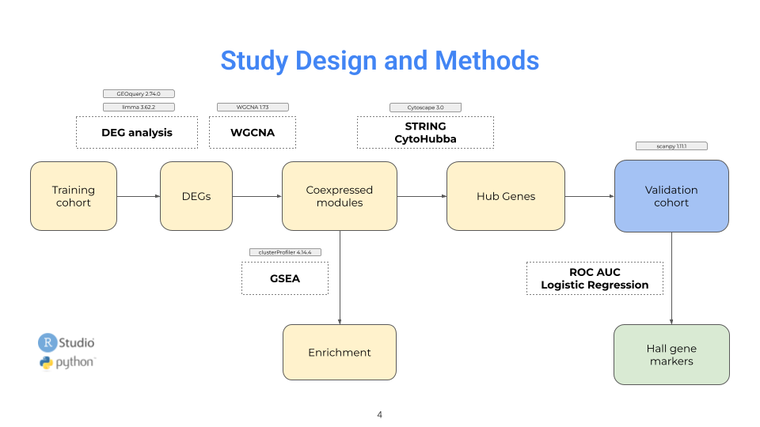|
|:-----------------------------------:|
| *Research workflow*            |

# Results

## 1. DEG analysis

DEG analysis allowed us to evaluate relative differences in expression profiles of responders and non-responders, exhibiting mostly upregulated genes among non-responders.

|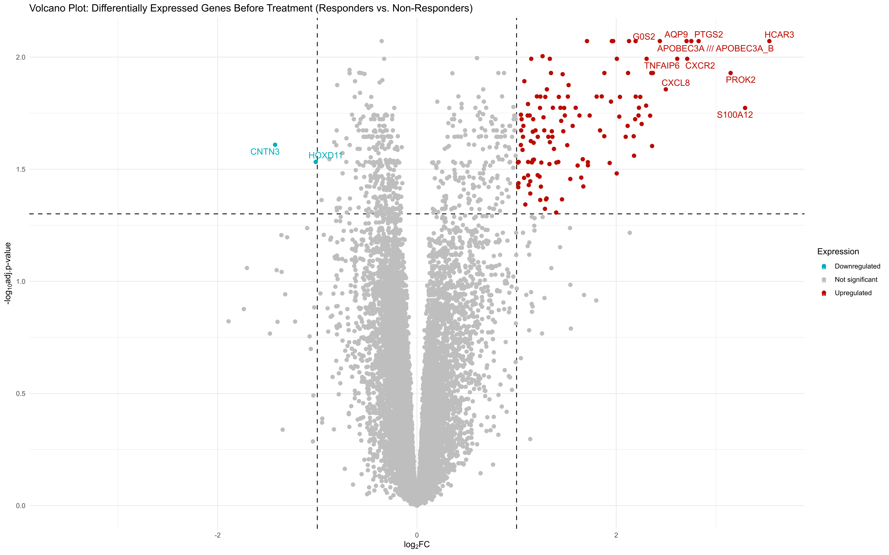|
|:-----------------------------------:|
| *Volcano plot UC (log₂FC > 1)*          |

||
|:-----------------------------------:|
| *Volcano plot CD (log₂FC > 1)*          |

## 2. WGCNA

After DEG identification the most correlated modules of genes were found using WGCNA. 

<table>
  <tr>
    <td width="50%" align="center">
      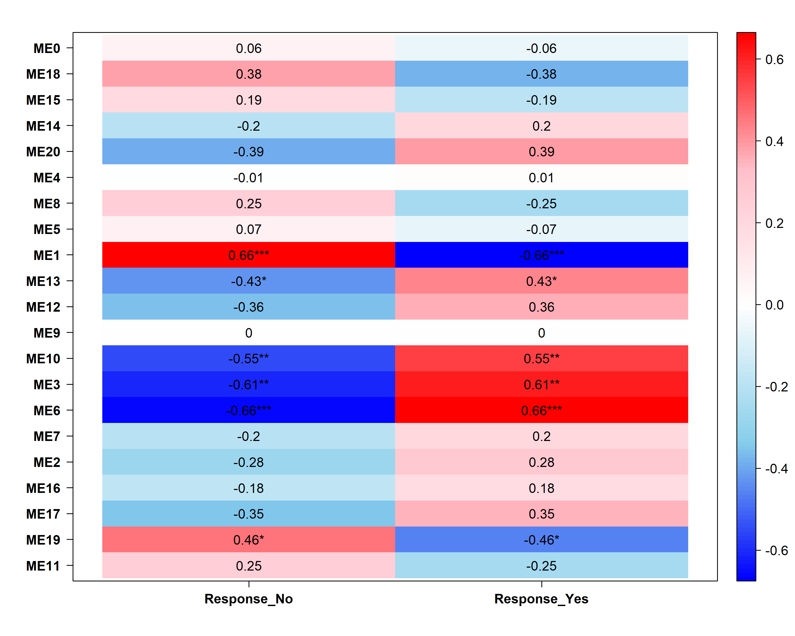
    </td>
    <td width="50%" align="center">
      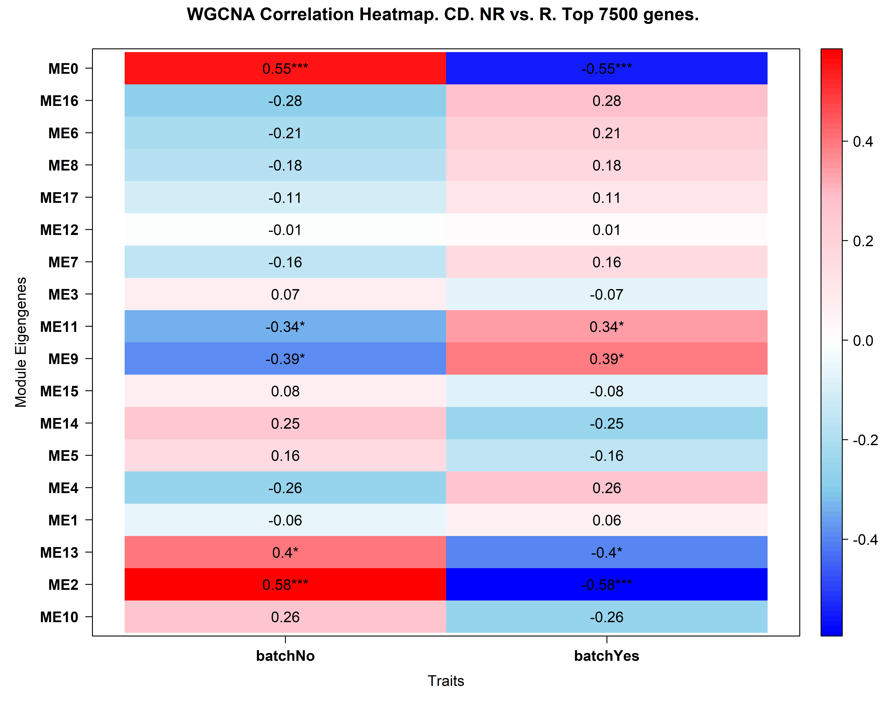
    </td>
  </tr>
  <tr>
    <td align="center"><em>Heatmap of gene co-expression modules in UC identified by WGCNA.  
*Color scale represents topological overlap (TOM) between genes in the most significantly enriched module (turquoise)</em></td>
    <td align="center"><em>Heatmap of gene co-expression modules in CD identified by WGCNA.  
*Color scale represents topological overlap (TOM) between genes in the most significantly enriched module (turquoise)</em></td>
  </tr>
</table>

The modules were compared to the Differentially Expressed Genes (DEGs) and Gene Set Enrichment were conducted for matching gene lists.

<table>
  <tr>
    <td align="center">
      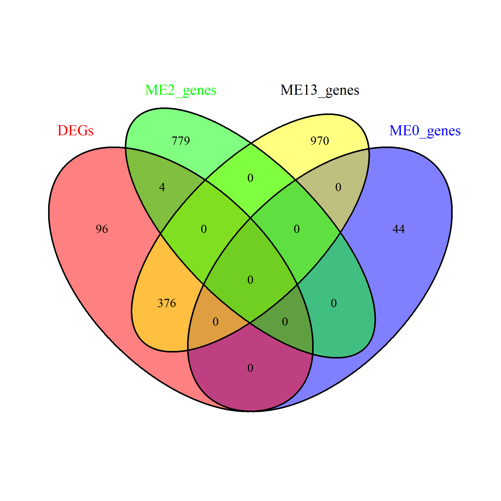
    </td>
  </tr>
  <tr>
    <td align="center"><em>Venn diagram for CD related modules</em></td>
  </tr>
</table>

  

    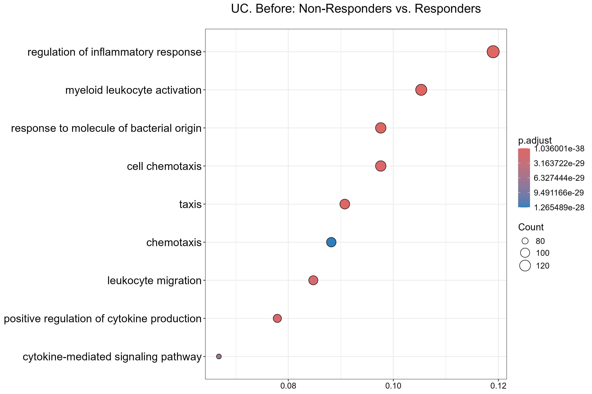
    
GO analysis for UC associated modules

  

  

    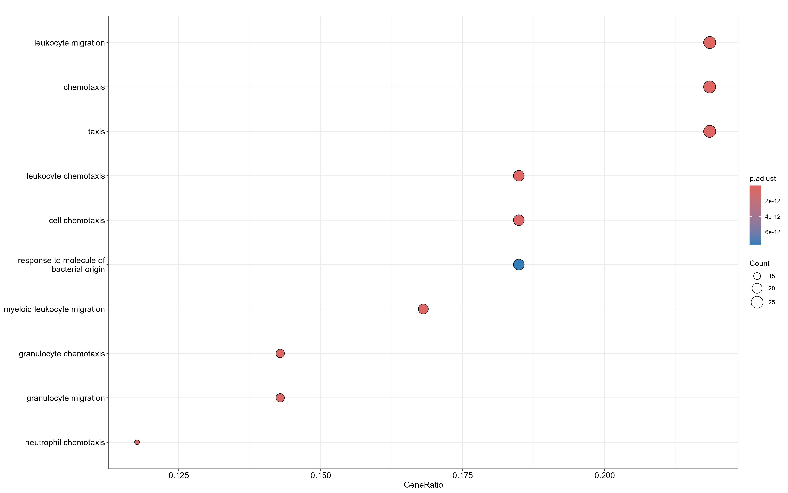
    
GO analysis for CD associated modules

  

This allowed us to identify several pathways responsible for leucocyte adhesion, migration and cytokine related pathways.

## 3. Hub genes identification

After that the following potential hub genes were identified for UC and CD.

|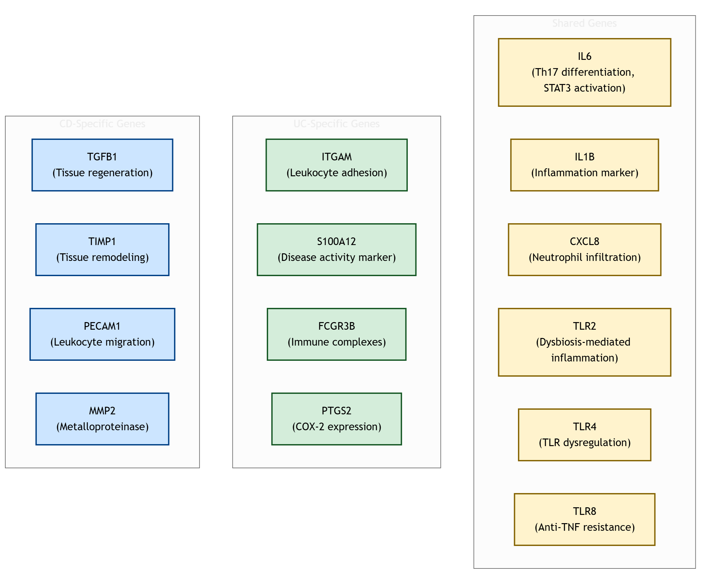|
|:-----------------------------------:|
| *Hub genes identified during the study. The colors correspond to the particular group of genes: CD specific - blue, UC specific - green, common genes - yellow*          |

In UC, five key genes — IL1B, IL6, CXCL8, TLR2, and TLR4-were common to CD and are mainly involved in innate immune responses. In addition, ITGAM and S100A12 have become UC-specific markers reflecting increased neutrophil infiltration. 

In CD, we similarly identified common immune-related hub genes (IL1B, IL6, CXCL8, TLR2, TLR4), as well as CD-specific markers associated with tissue remodeling and fibrosis — TGFB1, TIMP1, MMP2, and PECAM1 using results of pseudobulk analysis.

## 4. Validation and work with scRNA-seq data

### Ulcerative Colitis

The ROC-AUC analysis and logistic regression was then conducted in order to identify predictive ability of the genes common for CD and UC.

<table>
  <tr>
    <td width="50%" align="center">
      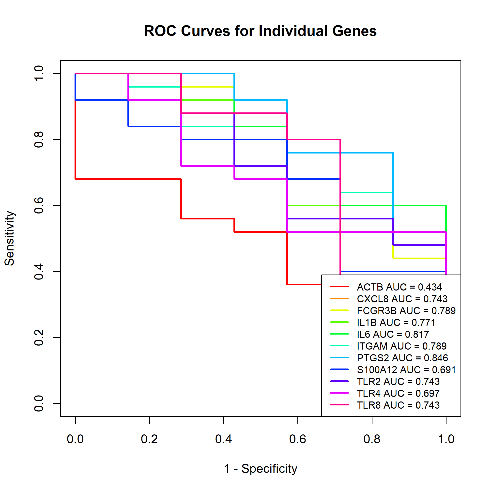
    </td>
    <td width="50%" align="center">
      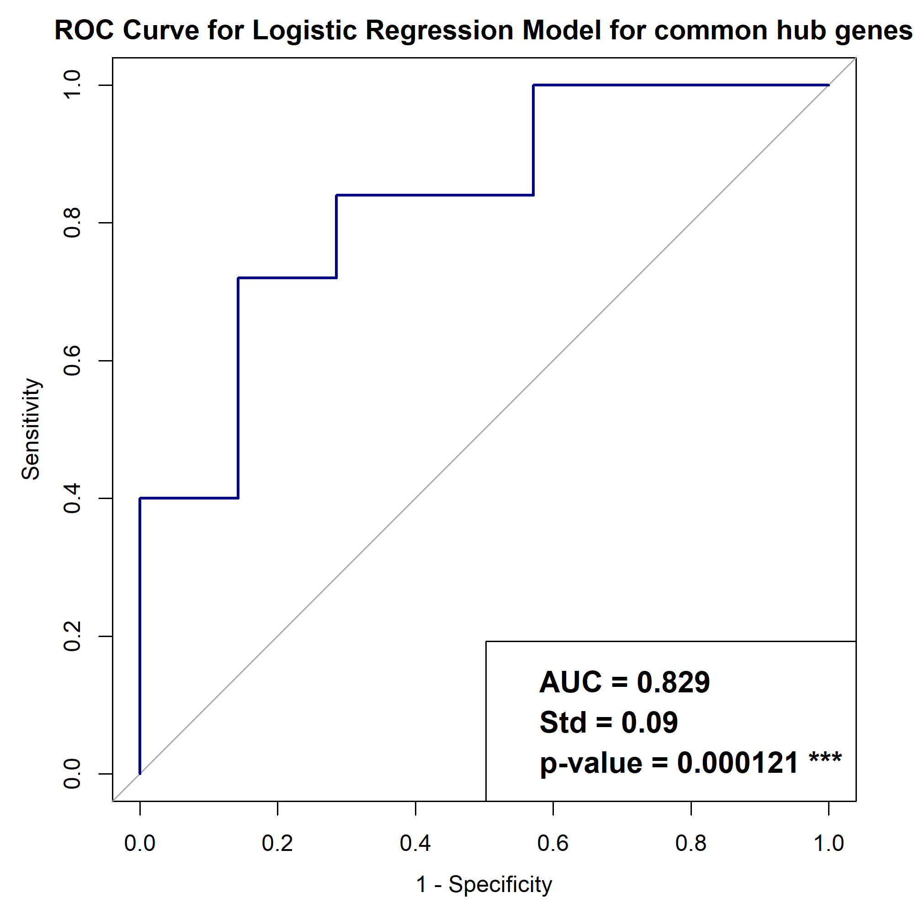
    </td>
  </tr>
  <tr>
    <td align="center"><em>ROC-AUC curve for each gene</em></td>
    <td align="center"><em>Logistic regression plot for combined model</em></td>
  </tr>
</table>

The logistic regression model based on a common set of genes demonstrated high predictive efficiency (AUC = 0.829), with IL6 (AUC = 0.817) and IL1B (AUC = 0.771) being the most informative individual predictors.

### Crohn Disease

The performance of the ROC-AUC for single common genes were lower compared to the UC, exhibiting the valuable scores only for IL6 (AUC = 0.53) and IL1B (AUC = 0.68), whereas the logistic regression model demonstrated the AUC score = 0.83. 

|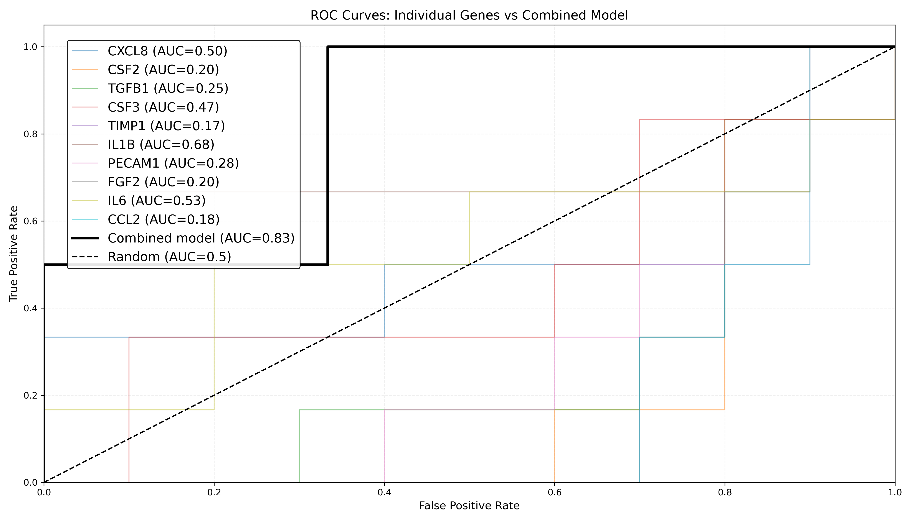|
|:-----------------------------------:|
| *ROC-curves for indvivdual genes and combined model in CD*          |

Analysis of the single-cell RNA-seq dataset also revealed a significantly higher proportion of monocytes with low IL1B levels among the respondents (p < 0.05), indicating a potential functional phenotype associated with better treatment outcomes.

|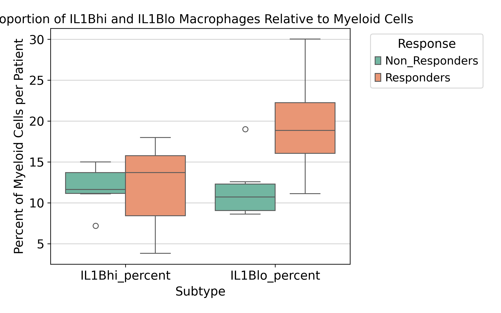|
|:-----------------------------------:|
| *Cell population expressing high (IL1Bhi) and low (IL1Blo) levels of IL1B. IL1Bhi_percent: Mann–Whitney U p-value = 0.635, IL1Blo_percent: Mann–Whitney U p-value = 0.011*          |

# Conclusion

Taken together, our results demonstrate that dysregulation of innate immune pathways — particularly IL1B- and TLR-mediated signaling — is a key determinant of resistance to anti-TNF therapy. These findings underscore the importance of incorporating innate immune activation status into patient stratification strategies and support the development of personalized treatment approaches based on molecular immune profiling.

# References
1. Rutgeerts, P., Van Assche, G., & Vermeire, S. (2006). Infliximab therapy for inflammatory bowel disease–seven years on, Alimentary pharmacology & therapeutics, 23(4): 451-463.
2. Shahini, A. and Shahini, A. (2023). Role of interleukin-6-mediated inflammation in the pathogenesis of inflammatory bowel disease: focus on the available therapeutic approaches and gut microbiome, J. Cell Commun. Signal, 17: 55-74 173.
3. Chen, W., Xu, Z., Jiang, J., Chen, L., Chen, Y., Yu, T., ... & Shi, R. (2023). CXCL8 as a Potential Biomarker for Crohn’s Disease is Associated with Immune Infiltration and RNA Methylation, Biochemical Genetics, 61(6): 2599-2617.
4. Ngoh, E. N., Weisser, S. B., Lo, Y., Kozicky, L. K., Jen, R., Brugger, H. K., ... & Sly, L. M. (2016). Activity of SHIP, which prevents expression of interleukin 1β, is reduced in patients with Crohn’s disease, Gastroenterology, 150(2): 465-476.
5. Tan, Y., Zou, K. F., Qian, W., Chen, S., & Hou, X. H. (2014). Expression and implication of toll-like receptors TLR2, TLR4, and TLR9 in colonic mucosa of patients with ulcerative colitis, Journal of Huazhong University of Science and Technology [Medical Sciences], 34: 785-790.
6. Gole, B., Pernat, C., Jezernik, G., & Potočnik, U. (2023). The expression IL1B correlates negatively with the clinical response to adalimumab in Crohn's disease patients: An ex vivo approach using peripheral blood mononuclear cells, Life Sciences, 326: 121822.

### Contributors
#### Authors:
* Galina Reshetnikova,  
*Bioinformatics Institute, St. Petersburg, Russia*     
galina.reshetnikova@helsinki.fi

* Ekaterina Scheglova,  
*Moscow Institute of Physics and Technology, Moscow, Russia, Bioinformatics Institute, St. Petersburg, Russia*     
scheglova.es@phystech.edu

* Aleksei Osipov,   
*ITMO University, St. Petersburg, Russia, Bioinformatics Institute, St. Petersburg, Russia*    
osipov.natgordon@gmail.com

* Artur Lee,    
*Koltzov Institute of Developmental Biology RAS, Moscow, Russia, Bioinformatics Institute, St. Petersburg, Russia*     
aal1999arth@gmail.com

#### Scientific advisor:
* Mariia Saliutina,     
*Charité - University Medicine Berlin, Germany, Bioinformatics Institute, St. Petersburg, Russia*  
mariia.saliutina@charite.de